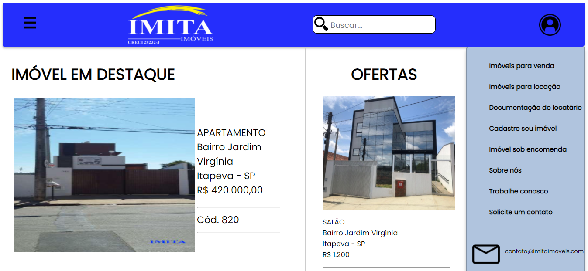

# Redesign Imita Imoveis

 O <b>Modelo a seguir</b> foi feito no figma pelo meu amigo [Matheus Máximos](https://github.com/MatheusMaximosAlmeida)  [Design no Figma](https://www.figma.com/file/xFEQrrACGfbx93hX943exI/Redesign-Imita-Imoveis?node-id=0%3A1), O código em HTML e CSS foi feito por mim
 

